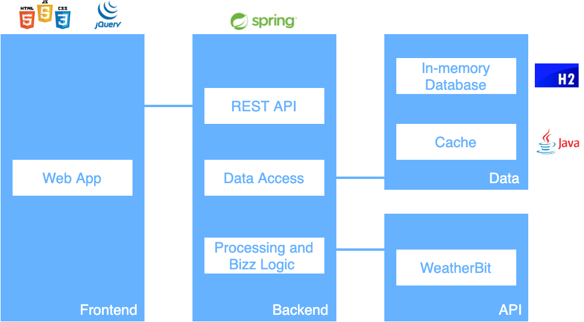
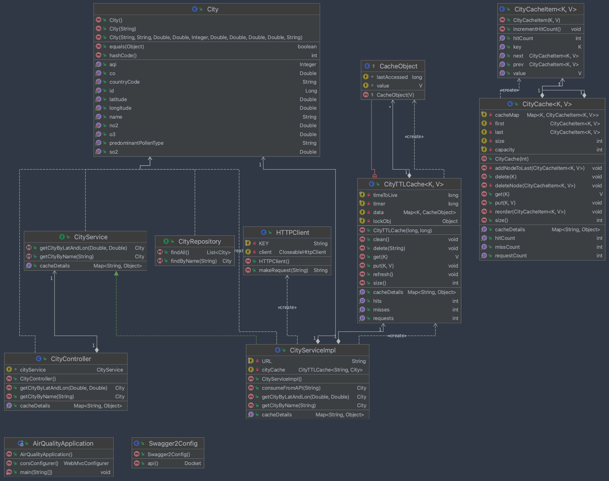

# AirQuality


<p align="center">
    
</p>

## Course
This project was developed under the [Software Quality And Tests](https://www.ua.pt/en/uc/8109) course of [University of Aveiro](https://www.ua.pt/).

## Overview of the work

This report presents the midterm individual project required for TQS, covering both the software product features and the adopted quality assurance strategy.

The objective of this project was to create a REST-API service, along with the implementation of tests to verify if everything in the application is working properly. These tests included:
* Unit tests.
* Unit tests with dependency isolation using mocks.
* Integration tests on API.
* Functional tests.

## AirQuality

The AirQuality product allows its user to get air quality data from a specific city, showing, for instance, the AQI (Air Quality Index) and some concentration levels (CO, O3, SO2, NO2), as well as the predominant pollen type of that specific city.

The data regarding the air quality for each city is gathered from the [WeatherBit's Air Quality](https://www.weatherbit.io/api/airquality-current) external API, and can be searched on the products’ webpage, either by the city name or by the latitude and longitude.

There was also implemented a local cache, making repeated calls being stored for 1 minute so that the retrieval of information is faster.

## Technologies / Frameworks

The following technologies / frameworks were used on this project:
* **Spring Boot**, a module of **Spring Framework** - Backend.
* **HTML**, **CSS** and **JS** - Frontend.
* **jQuery's AJAX** - API requests between frontend and backend.
* **Swagger2** - API documentation.
* **JUnit 5** - Unit tests.
* **Mockito** - Unit tests with dependency isolation using mocks.
* **Selenium Web Driver** - Functional tests.
* **Spring Boot MockMVC** - Integration tests.

## Running the Application

AirQuality can be locally deployed. That can be done by running the following command on the repository’s root directory: 

```shell
docker-compose up
```

When everything is up and running, the website can be accessed at: http://localhost:8000/

## Demo

Demo video will be available soon!

## SonarQube Dashboard

SonarQube Dashboard will be available soon!

## System Architecture
<p align="center">
    
</p>

## UML Classes Diagram
<p align="center">
    
</p>

## Authors
* **Eduardo Santos**: [eduardosantoshf](https://github.com/eduardosantoshf)